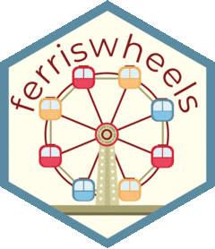

<!-- README.md is generated from README.Rmd. Please edit that file -->

```{r, include = FALSE}
knitr::opts_chunk$set(
  collapse = TRUE,
  comment = "#>",
  fig.path = "man/figures/README-",
  out.width = "100%"
)
```

# ferriswheels 

<!-- badges: start -->
<!-- badges: end -->

The goal of ferriswheels is to provide a fun harmless little data set to play with

## Installation

You can install the development version of ferriswheels like so:

``` r
remotes::install_github("emilhvitfeldt/ferriswheels")
```

## Example

This data set contains a number of interesting variables to play with.

```{r example}
library(ferriswheels)
str(wheels)
```

For starters, we can look at the diameter and height, colored by the number of cabins

```{r, warning=FALSE, message=FALSE}
library(tidyverse)

wheels |>
  ggplot(aes(height, diameter, color = number_of_cabins)) +
  geom_point() +
  scale_color_viridis_b()
```

If we look at the height of the Ferris wheels as a function of opening date, we see that in the most recent time that the height have gotten larger and larger.

```{r, warning=FALSE}
wheels |>
  ggplot(aes(opened, height)) +
  geom_point()
```

Now image we want to get a feel for how these Ferris wheels look. We can construct them ourselves.

```{r}
library(ggforce)

# We need complete data for these calculations
complete_wheels <- wheels |>
  select(name, height, diameter, number_of_cabins) |>
  drop_na()

set.seed(1234)
selected_complete_wheels <- complete_wheels |>
  # We have limited plotting space, so we are filtering to only include the
  # ferris wheels with the best spread out carts
  slice_max(order_by = diameter / number_of_cabins, n = 6, with_ties = FALSE)

# We are creating a seperate data.frame for the position of the carts
carts <- selected_complete_wheels |>
  group_by(name) |>
  summarise(
    cart = seq_len(number_of_cabins),
    # Get x and y for the carts
    cart_x = cos(cart / number_of_cabins * 2 * pi),
    cart_y = sin(cart / number_of_cabins * 2 * pi),
    # Size them to be the right distance from the center
    cart_x = cart_x * (diameter / 2),
    cart_y = cart_y * (diameter / 2),
    # Make sure the carts are raised enough
    cart_y = cart_y + height - diameter / 2,
    # Lower the carts just a bit so it appears they are hanging
    cart_y = cart_y - 12.5,
    cart_color = as.character(cart %% 3),
    .groups = "drop"
  )

selected_complete_wheels |>
  ggplot() +
  # Grass
  geom_abline(slope = 0, intercept = 0, color = "darkgreen") +
  ylim(0, NA) +
  # Ferris wheel circle
  geom_circle(aes(x0 = 0, y0 = height - diameter / 2, r = diameter / 2)) +
  # Left leg
  geom_segment(aes(x = -(height - diameter / 2)/2, xend = 0,
                   yend = height - diameter / 2, y = 0)) +
  # right leg
  geom_segment(aes(x = (height - diameter / 2)/2, xend = 0,
                   yend = height - diameter / 2, y = 0)) +
  # Carts
  geom_point(aes(cart_x, cart_y, fill = cart_color), data = carts, shape = 24) +
  facet_wrap(~name) +
  coord_fixed() +
  theme_minimal() +
  guides(fill = "none") +
  labs(y = NULL, x = NULL)
```
