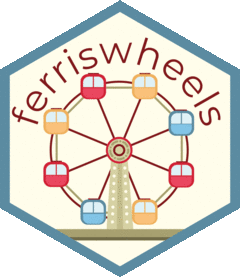
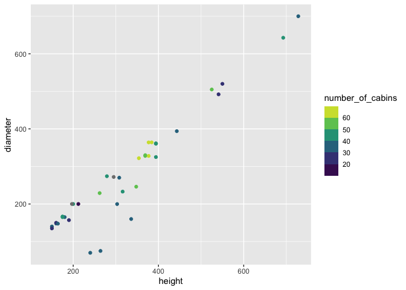

<!-- README.md is generated from README.Rmd. Please edit that file -->

# ferriswheels 

<!-- badges: start -->
<!-- badges: end -->

The goal of ferriswheels is to provide a fun harmless little data set to
play with

## Installation

You can install the development version of ferriswheels like so:

``` r
remotes::install_github("emilhvitfeldt/elevators")
```

## Example

``` r
library(ferriswheels)
str(wheels)
#> Classes 'tbl_df', 'tbl' and 'data.frame':    73 obs. of  21 variables:
#>  $ name                 : chr  "360 Pensacola Beach" "Amuran" "Asiatique Sky" "Aurora Wheel" ...
#>  $ height               : num  200 303 200 295 180 ...
#>  $ diameter             : num  NA 200 200 272 NA ...
#>  $ opened               : Date, format: "2012-07-03" "2004-01-01" ...
#>  $ closed               : Date, format: "2013-01-01" NA ...
#>  $ country              : chr  "USA" "Japan" "Tailand" "Japan" ...
#>  $ location             : chr  "Pensacola Beach; Florida" "Kagoshima; Kyushu" "Asiatique the Riverfront" "Nagashima Spa Land; Mie; Honshu" ...
#>  $ number_of_cabins     : int  42 36 42 NA 40 48 42 NA 36 48 ...
#>  $ passengers_per_cabin : int  6 NA NA NA 6 40 8 NA 8 8 ...
#>  $ seating_capacity     : int  252 NA NA NA 240 1920 336 NA 288 384 ...
#>  $ hourly_capacity      : int  1260 NA NA NA 960 5760 1550 NA 1440 1152 ...
#>  $ ride_duration_minutes: num  12 14.5 NA NA 15 20 13 15 12 20 ...
#>  $ climate_controlled   : chr  "Yes" "Yes" "Yes" NA ...
#>  $ construction_cost    : chr  "Unknown" "Unknown" "Unknown" "Unknown" ...
#>  $ status               : chr  "Moved" "Operating" "Operating" "Operating" ...
#>  $ design_manufacturer  : chr  "Realty Masters of FL" NA "Dutch Wheels (Vekoma)" NA ...
#>  $ type                 : chr  "Transportable" NA NA "Fixed" ...
#>  $ vip_area             : chr  "Yes" NA NA NA ...
#>  $ ticket_cost_to_ride  : chr  NA NA NA NA ...
#>  $ official_website     : chr  NA NA "http://www.asiatiquesky.com/" "http://www.nagashima-onsen.co.jp/" ...
#>  $ turns                : num  4 1 NA NA NA 1 1 NA 3 NA ...
```

``` r
library(ggplot2)

wheels |>
  ggplot(aes(height, diameter, color = number_of_cabins)) +
  geom_point()
```


